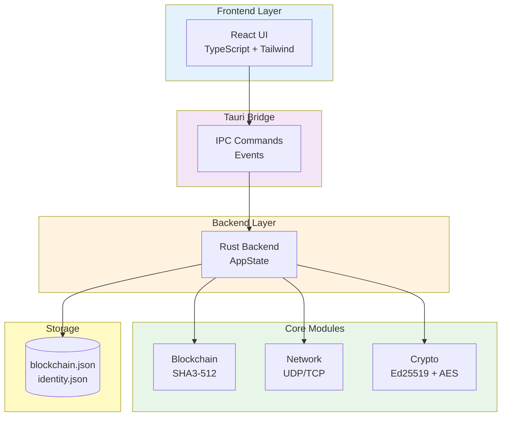

# System Architecture Diagram - WiChain

## System Architecture

```mermaid
graph TB
    subgraph Frontend["Frontend Layer"]
        UI[React UI<br/>TypeScript + Tailwind]
    end
    
    subgraph Tauri["Tauri Bridge"]
        Bridge[IPC Commands<br/>Events]
    end
    
    subgraph Backend["Backend Layer"]
        App[Rust Backend<br/>AppState]
    end
    
    subgraph Core["Core Modules"]
        BC[Blockchain<br/>SHA3-512]
        NET[Network<br/>UDP/TCP]
        CRYPTO[Crypto<br/>Ed25519 + AES]
    end
    
    subgraph Data["Storage"]
        DB[(blockchain.json<br/>identity.json)]
    end
    
    UI --> Bridge
    Bridge --> App
    App --> BC
    App --> NET
    App --> CRYPTO
    App --> DB
    
    style Frontend fill:#e3f2fd
    style Backend fill:#fff3e0
    style Core fill:#e8f5e9
    style Data fill:#fff9c4
    style Tauri fill:#f3e5f5
```
