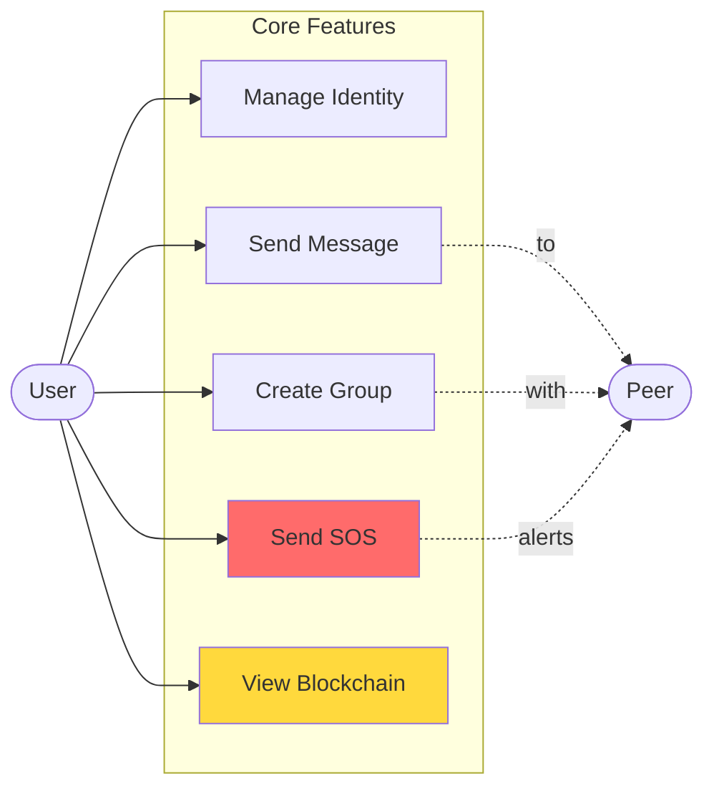

# Use Case Diagram - WiChain

## Core Use Cases

## Detailed Use Case Descriptions

### Identity Management
- **UC1: Set Alias** - User creates or updates their display name
- **UC2: Generate Keys** - System generates Ed25519 keypair for user
- **UC3: View Identity** - User views their public key and identity details

### Direct Messaging
- **UC4: Send Text Message** - User sends encrypted text to peer
- **UC5: Send Image** - User shares compressed images (JPEG)
- **UC6: Send Voice Message** - User records and sends audio
- **UC7: Send File** - User shares files up to 25MB
- **UC8: Receive Message** - User receives and decrypts messages
- **UC9: Verify Message** - System verifies Ed25519 signature

### Group Communication
- **UC10: Create Group** - User creates group with selected peers
- **UC11: Join Group** - User joins an existing group
- **UC12: Send Group Message** - User broadcasts to all group members
- **UC13: Update Group Name** - User changes group display name
- **UC14: List Groups** - User views all active groups

### Emergency Features
- **UC15: Send SOS Alert** - User broadcasts emergency distress signal
- **UC16: Emergency Broadcast** - User sends critical alert to all peers
- **UC17: Receive SOS** - User receives and displays SOS with priority

### Media Communication
- **UC18: Video Call Request** - User initiates WebRTC video call
- **UC19: Accept Video Call** - User accepts incoming call
- **UC20: Take Photo** - User captures and sends camera photo
- **UC21: Record Audio** - User records voice message
- **UC22: Screenshot** - User captures and shares screen

### Blockchain Operations
- **UC23: View Blockchain** - User browses local blockchain
- **UC24: Verify Chain Integrity** - System validates all blocks
- **UC25: Export Blockchain** - User exports blockchain JSON

### Network Operations
- **UC26: Discover Peers** - System broadcasts presence via UDP
- **UC27: Test Connection** - User tests TCP connectivity with peer
- **UC28: View Connection Status** - User sees active connections

### System Operations
- **UC29: Reset Data** - User clears all local data
- **UC30: View Advanced Features** - User accesses blockchain/debug tools
- **UC31: Run Tests** - Developer runs integration tests
