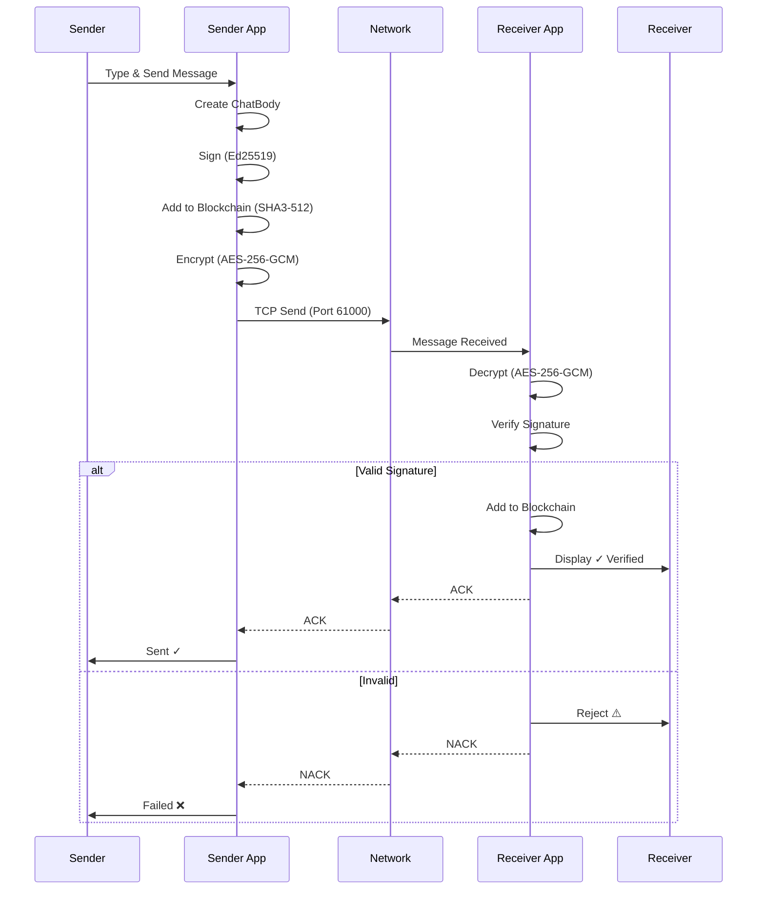

# Sequence Diagram - WiChain

## Complete Message Flow (Send & Receive)

## Key Components

- **Ed25519 Signing**: All messages digitally signed for authenticity
- **AES-256-GCM Encryption**: Message confidentiality with nonce
- **SHA3-512 Blockchain**: Tamper-evident message history
- **TCP Transport**: Reliable delivery on port 61000
- **Dual Verification**: Both sender and receiver update blockchain independently
