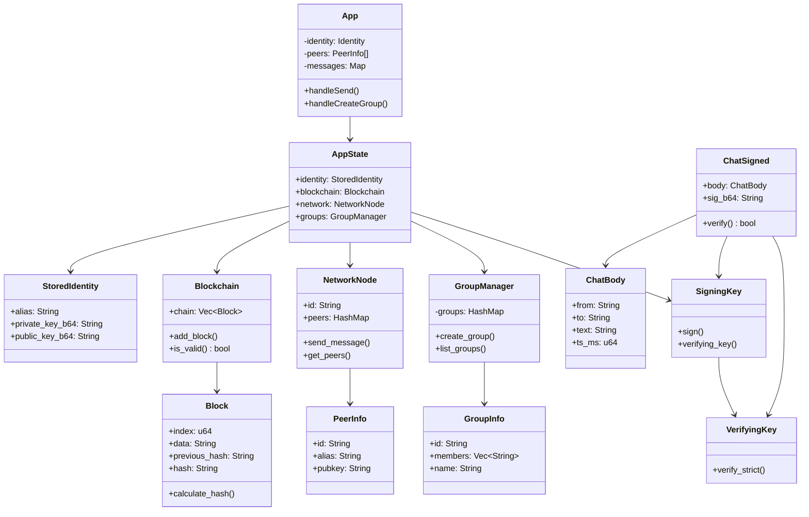

# Class Diagram - WiChain

## Core System Classes

## Core Relationships

### Frontend-Backend Communication
- **App** orchestrates all UI components
- Components communicate via Tauri API commands
- Backend emits events that update frontend state

### Backend Architecture
- **AppState** is the central state manager
- All Tauri commands access AppState
- AppState coordinates between modules

### Blockchain Layer
- **Blockchain** manages chain of **Block**s
- Each Block contains data and cryptographic hash
- Blocks can contain SignedMessages or DirectTextPayload

### Network Layer
- **NetworkNode** manages peer discovery and connections
- Uses **TcpConnectionManager** for persistent connections
- **PeerInfo** exposed to frontend, **PeerEntry** internal

### Cryptography
- **SigningKey** for creating signatures
- **VerifyingKey** for verification
- **CryptoUtils** for AES encryption

### Group Management
- **GroupManager** maintains group registry
- **GroupInfo** stores group metadata
- Signed messages for group operations
