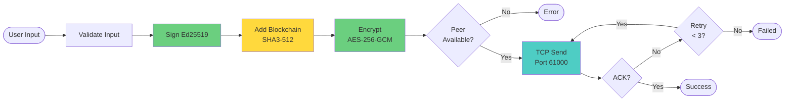

# Activity Diagram - WiChain

## Message Flow Process

## Process Description

### Main Flow
1. **User Input** - Different message types handled
2. **Validation** - Size and format checks
3. **Signing** - Ed25519 digital signature
4. **Blockchain** - Add to local blockchain with SHA3-512
5. **Encryption** - AES-256-GCM with random nonce
6. **Transport** - TCP delivery with retry logic
7. **Confirmation** - ACK/NACK handling

### Parallel Processes
- **Peer Discovery** - Continuous UDP broadcast (500ms interval)
- **Registry Maintenance** - Remove stale peers (>30s timeout)
- **Connection Management** - TCP connection pool

### Error Handling
- Offline peer detection
- Retry mechanism (3 attempts)
- Signature verification failure paths
- Network timeout handling
