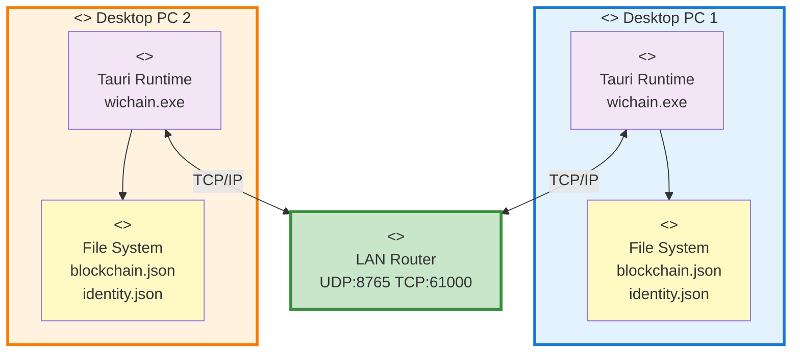

# Deployment Diagram - WiChain

## UML Deployment Diagram



## Deployment Specifications

### System Requirements
| Component | Specification |
|-----------|--------------|
| **OS** | Windows 10+, Ubuntu 20.04+, macOS 11+ |
| **CPU** | Dual-core 1.5GHz+ |
| **RAM** | 2GB minimum, 4GB recommended |
| **Storage** | 200MB app + 100MB user data |
| **Network** | WiFi 802.11n or Ethernet 100Mbps+ |

### Network Ports
| Port | Protocol | Purpose | Direction |
|------|----------|---------|-----------|
| **8765** | UDP | Peer discovery broadcast | Bidirectional |
| **61000** | TCP | Encrypted message transport | Bidirectional |

### File System Layout
```
~/.wichain/                  (Linux/macOS)
%APPDATA%/wichain/           (Windows)
├── identity.json            (Ed25519 keys, alias)
├── blockchain.json          (Message blockchain)
└── config.json              (App settings)
```

### Installation Packages
| Platform | File | Size |
|----------|------|------|
| **Windows** | wichain_x64.msi | 45MB |
| **Linux** | wichain_amd64.deb | 42MB |
| **Linux** | wichain.AppImage | 48MB |
| **macOS** | wichain_x64.dmg | 50MB |

### Security Layers
1. **Identity** - Ed25519 256-bit keys
2. **Message** - AES-256-GCM encryption
3. **Blockchain** - SHA3-512 hashing
4. **Network** - Per-message encryption
5. **Application** - Memory safety (Rust)

### Network Topology
- ✅ Point-to-Point (Direct)
- ✅ Star (Via Router)
- ✅ 100% Offline LAN
- ⏳ Mesh (Future)
- ⏳ WiFi Direct (Future)
