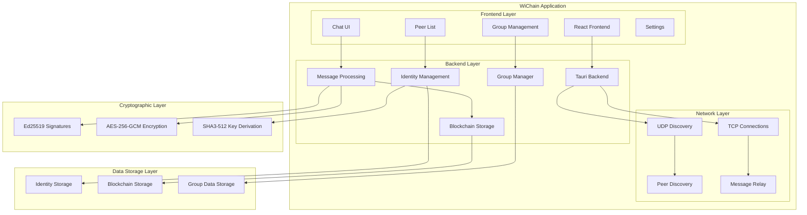
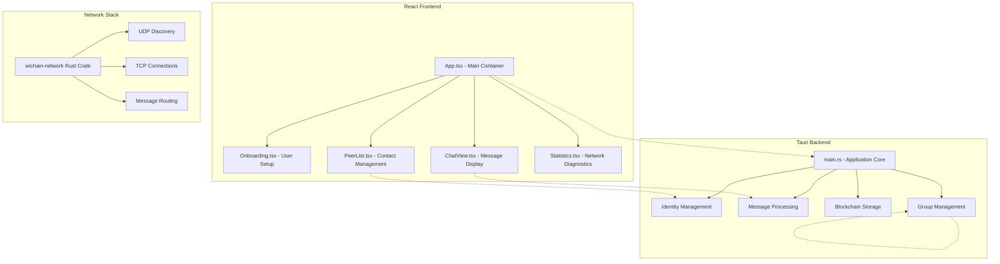
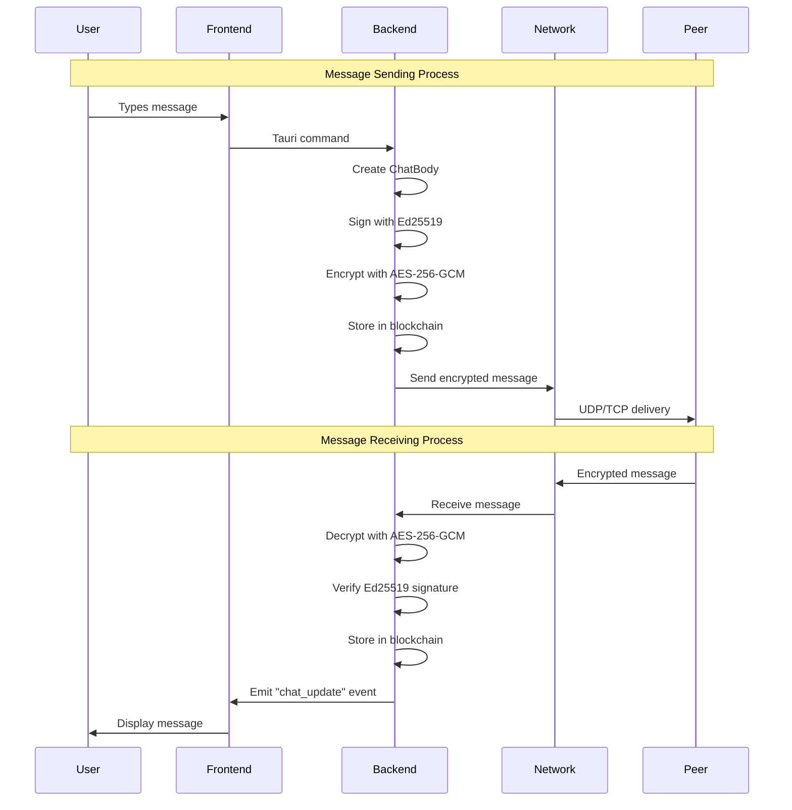
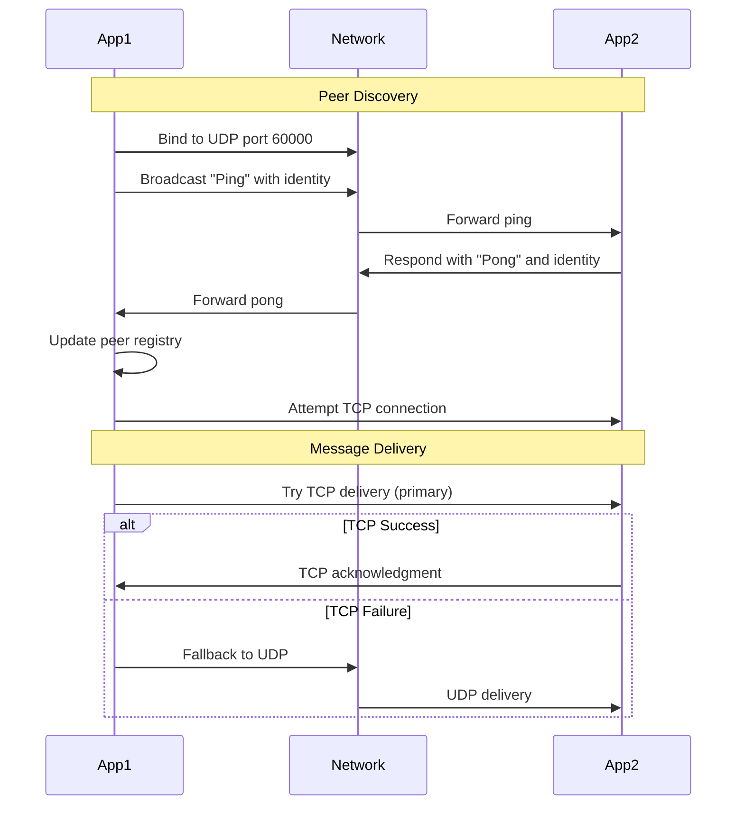
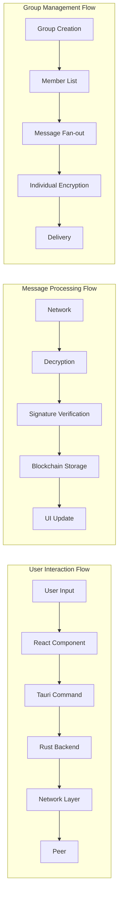
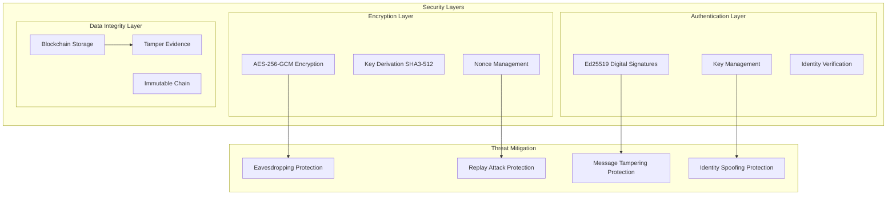
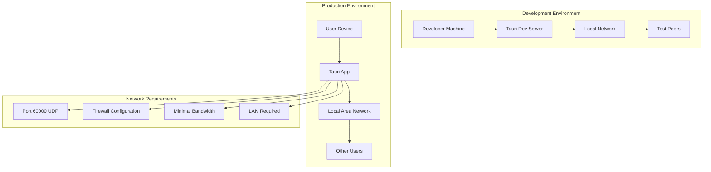
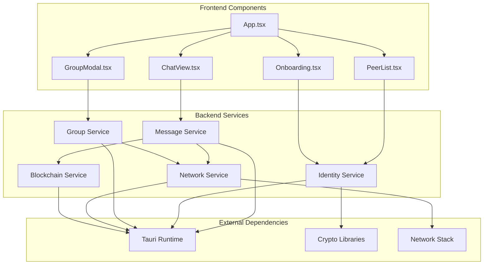

# WiChain System Architecture - Mermaid Diagrams

## High-Level System Architecture



## Detailed Component Architecture



## Cryptographic Flow



## Network Protocol Flow



## Data Flow Architecture



## Security Architecture



## Deployment Architecture



## Performance Characteristics

```mermaid
graph LR
    subgraph "Network Performance"
        UDPLat[UDP Latency: 1-5ms]
        TCPLat[TCP Latency: 1-3ms]
        Throughput[Limited by Bandwidth]
        Scale[Up to 100 peers]
    end
    
    subgraph "Crypto Performance"
        Sign[Ed25519 Sign: 0.1ms]
        Verify[Ed25519 Verify: 0.2ms]
        Encrypt[AES Encrypt: 0.05ms]
        Decrypt[AES Decrypt: 0.05ms]
    end
    
    subgraph "Storage Performance"
        MsgSize[1KB per message]
        Growth[Linear growth]
        Search[O(n) search]
        Export[1000 msg/sec export]
    end
```

## Component Interaction Diagram



This comprehensive set of Mermaid diagrams visualizes the complete WiChain system architecture, including:

1. **High-Level System Architecture** - Overall system structure
2. **Detailed Component Architecture** - Frontend, Backend, and Network layers
3. **Cryptographic Flow** - Message sending and receiving processes
4. **Network Protocol Flow** - Peer discovery and message delivery
5. **Data Flow Architecture** - User interaction, message processing, and group management flows
6. **Security Architecture** - Security layers and threat mitigation
7. **Deployment Architecture** - Development and production environments
8. **Performance Characteristics** - Network, crypto, and storage performance metrics
9. **Component Interaction Diagram** - How different components interact with each other

Each diagram focuses on a specific aspect of the system while maintaining consistency with the overall architecture described in the SYSTEM_ARCHITECTURE.md document.

